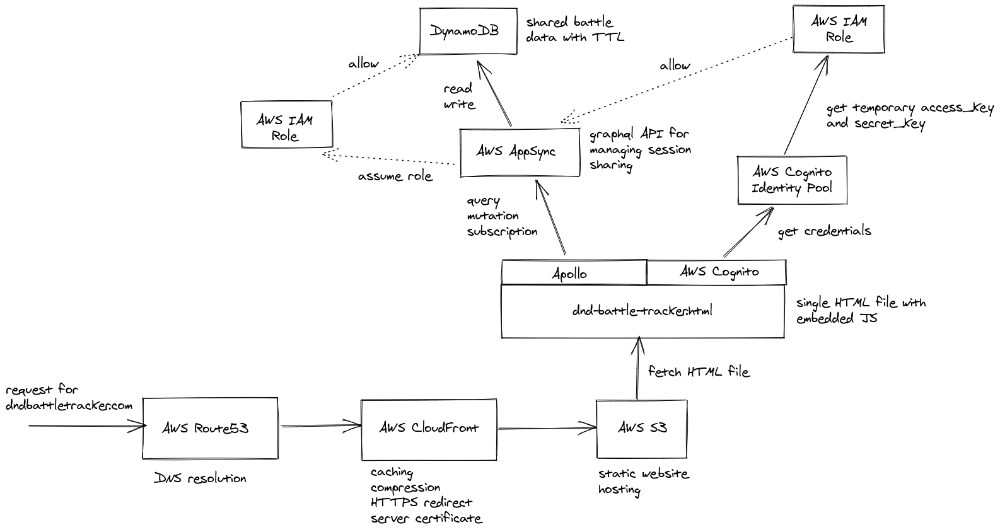

# [D&D Battle Tracker](http://dndbattletracker.com/)

D&D Battle Tracker is an initiative and combat tracker tool for Dungeons & Dragons 5th Edition (D&D 5e). Track the initiative and status of all creatures involved in combat with this D&D combat tracker!

Feature ideas and general feedback welcome on [Ko-fi](https://ko-fi.com/paulbod). Bugs can be reported through [Github issues](https://github.com/Paul-Ladyman/dnd-battle-tracker/issues/new).

## Use

The D&D Battle Tracker is a web application designed to run in a browser but does not require an internet connection.

First, [access the live D&D Battle Tracker](http://dndbattletracker.com/). The application will then be saved in your browser for offline use. If your mobile or desktop browser supports it you can install the Battle Tracker as a [Progressive Web App](https://support.google.com/chrome/answer/9658361?hl=en-GB&co=GENIE.Platform%3DDesktop) on your device so you can easily access it whenever you need to.

You can also download a specific release of D&D Battle Tracker below and open it in your favourite browser. This will be necessary if you have downloaded an in-progress battle that is no longer compatible with the live application:

* [Latest release](https://github.com/Paul-Ladyman/dnd-battle-tracker/releases/latest)
* [List of previous releases](https://github.com/Paul-Ladyman/dnd-battle-tracker/releases)

For a particular release download the file `dnd-battle-tracker.zip` under Assets, unzip it and open the file `index.html` in a browser. For older releases you can download and open the `dnd-battle-tracker.html` file directly.

## Motivation

As a new DM I found that I was frequently making mistakes during combat, such as:

* Forgetting who's turn it was or skipping a creature's turn altogether.
* Forgetting what conditions creatures were under.
* Doing maths wrong when applying damage to creatures (!)

It was clear that some automation would be helpful. There's a number of browser-based combat trackers out there at the time of writing, in no particular order:

* [D&D Beyond](https://www.dndbeyond.com/combat-tracker)
* [Avrae](https://avrae.io/) (Discord bot usable in the browser)
* [Aide D&D](https://www.aidedd.org/en/online-assistant/)
* [Kastark](https://kastark.co.uk/rpgs/encounter-tracker/)
* [Donjon](https://donjon.bin.sh/5e/initiative/)
* [Shieldmaiden](https://shieldmaiden.app/) (Previously Harmless Key)
* [Improved Initiative](https://improvedinitiative.app/)
* [Kassoon](https://www.kassoon.com/dnd/combat-tracker/)
* [Orc Pub](https://www.orcpub2.com/) ([replaced by Dungeon Master's Vault](https://www.dungeonmastersvault.com/help/faq-about-orcpub-and-dungeonmastersvault/) though seemingly without a combat tracker)
* Full VTTs like [Roll20](https://app.roll20.net/sessions/new), [Fantasy Grounds](https://www.fantasygrounds.com/), [Owlbear Rodeo](https://www.owlbear.rodeo/), [Foundry](https://foundryvtt.com/), [Forge](https://forge-vtt.com/)
* [HeroMuster](https://encounters.heromuster.com/)
* [5e Tools](https://5e.tools/dmscreen.html) (click the add button then go to Special and add the Initiative Tracker. Player view also available)
* [DM Tools](https://dm.tools/tracker)
* [Role Generator](https://www.rolegenerator.com/en/module/initiative-tracker)
* [Dungeons & Dragons Battle Tracker](https://battletracker.jazzsequence.com/bad84fad-19ba-2e17-3a6f360ea05c)
* [DnD Combat Tracker](https://santiagoclv.github.io/dnd-combat-tracker/)
* [DnD Combat Tracker](https://dnd.achim-strauss.net/)
* [Monstrous Initiative Tracker](https://brewchetta.github.io/monstrous-initiative-tracker/)
* [Warforged 5e](https://warforged5e.com/)

Many of these systems are very feature rich and aim to provide tools beyond the combat tracker itself, which is great. However that does mean that they come with a learning curve and several are gated-off behind login screens.

This D&D Battle Tracker simply aims to automate the process of tracking combat using a pen and paper. It attempts to do this in a way that is as straight-forward and easy to use as possible. As such it does not do things like provide custom character creation tools, battle map creation tools or provide content from the Player's Hand Book. Instead it focuses on automating the smaller things that are prone to error and often distract a DM from the combat itself.

## Features

* Core DM features work entirely offline.
* Create a list of creatures who are involved in combat by adding a name, initiative score and health points for each one.
* Track creature status pre- and post-battle so active conditions carry into battle and persist when its over.
* Automatically order creatures by their initiative.
* Keep track of who's turn it is as combat progresses as well as what the current round is and how long combat has lasted.
* Keep track of creature conditions and any additional notes and how long they have been applied.
* Make it obvious when conditions or notes have been applied to help the DM not to forget to take them into account.
* Provide links to D&D Beyond's list of condition descriptions and monsters.
* Manage the health points of enemy creatures or NPCs allowing HP to be added and removed whilst supporting adding PCs to the creature list without HP.
* Allowing creatures to be killed/made unconscious and making it obvious to the DM that this has happened.
* Creatures can be added to or removed from the list at any time, even after combat has started.
* Save and load battles in case they continue into another session.
* Share your battle with your players so they can see the initiative order and follow along. Requires internet access.

## License and Credits

* This application (D&D Battle Tracker) is offered for use under the terms of the [MIT license](https://github.com/Paul-Ladyman/dnd-battle-tracker/blob/master/LICENSE)
* Dungeons & Dragons 5th Edition content (e.g. monster stats) provided by [dnd5eapi](https://www.dnd5eapi.co/) under the terms of the [Systems Reference Document and Open-Gaming License](https://dnd.wizards.com/resources/systems-reference-document). The dnd5eapi itself is used under the terms of the [MIT license](https://github.com/5e-bits/5e-srd-api/blob/main/LICENSE.md)
* All icons taken from [game-icons.net](https://game-icons.net/) under the terms of the [Creative Commons 3.0 BY license](https://creativecommons.org/licenses/by/3.0/). See below for individual credits.
* Fonts provided by [Google Fonts](https://fonts.google.com/) under the terms of the [Apache License, Version 2.0](http://www.apache.org/licenses/LICENSE-2.0). See below for individual credits.
* [Critical Role](https://www.youtube.com/channel/UCpXBGqwsBkpvcYjsJBQ7LEQ) for the inspiration.
* This application is not affiliated with, endorsed, sponsored, or specifically approved by Wizards of the Coast LLC.

### Icons

* [Play button](https://game-icons.net/1x1/guard13007/play-button.html) icon by [Guard13007](https://guard13007.com/)
* [Cancel](https://game-icons.net/1x1/sbed/cancel.html) icon by [sbed](https://opengameart.org/content/95-game-icons)
* [Hearts](https://game-icons.net/1x1/skoll/hearts.html) icon by Skoll
* Icons by [Delapouite](https://delapouite.com/):
  * [Hamburger menu](https://game-icons.net/1x1/delapouite/hamburger-menu.html)
  * [Save arrow](https://game-icons.net/1x1/delapouite/save-arrow.html)
  * [Share](https://game-icons.net/1x1/delapouite/share.html)
  * [Padlock open](https://game-icons.net/1x1/delapouite/padlock-open.html)
  * [Contract](https://game-icons.net/1x1/delapouite/contract.html)
  * [Expand](https://game-icons.net/1x1/delapouite/expand.html)
  * [Trash can](https://game-icons.net/1x1/delapouite/trash-can.html)
  * [Pencil](https://game-icons.net/1x1/delapouite/pencil.html)
  * [Player time](https://game-icons.net/1x1/delapouite/player-time.html)
  * [Next button](https://game-icons.net/1x1/delapouite/next-button.html)
  * [ID Card](https://game-icons.net/1x1/delapouite/id-card.html)
  * [Spell book](https://game-icons.net/1x1/delapouite/spell-book.html)
* Icons by [Lorc](http://lorcblog.blogspot.com/):
  * [Magnifying glass](https://game-icons.net/1x1/lorc/magnifying-glass.html)
  * [Crossed swords](https://game-icons.net/1x1/lorc/crossed-swords.html)
  * [Padlock](https://game-icons.net/1x1/lorc/padlock.html)
  * [Skull crossed bones](https://game-icons.net/1x1/lorc/skull-crossed-bones.html)
  * [Two shadows](https://game-icons.net/1x1/lorc/two-shadows.html)
  * [Backup](https://game-icons.net/1x1/lorc/backup.html)
  * [Cog](https://game-icons.net/1x1/lorc/cog.html)

### Fonts

* [Open Sans](https://fonts.google.com/specimen/Open+Sans) font by Steve Matteson
* [IM Fell Great Primer SC](https://fonts.google.com/specimen/IM+Fell+Great+Primer+SC) font by Igino Marini

## Development

### Checkout and install

     $ git clone git@github.com:Paul-Ladyman/dnd-battle-tracker.git
     $ cd dnd-battle-tracker
     $ npm install

### To run

     $ npm start

### To test

Unit and integration tests:

     $ npm test

End to end tests:

     $ npx playwright install --with-deps
     $ npm run test:e2e

## Architecture

## Deployment Pipeline

- Following a Continuous Integration workflow, all commits to `master` will trigger the execution of automated tests and a build of the project
- Commits to `master` that successfully pass the CI step will result in the build artefact being deployed to the [staging environment](https://github.com/Paul-Ladyman/dnd-battle-tracker/deployments/activity_log?environment=staging)
- Commits to `master` that include a change in the package version and have successfully passed the CI and stage deploy steps will be deployed to the [production environment](https://github.com/Paul-Ladyman/dnd-battle-tracker/deployments/activity_log?environment=production)
- In this way, a Continuous Delivery workflow can be followed by increasing the version in the same commit as the code is modified. If a manual testing step is called for, the version can be left as it is and the change tested on the stage environment. A version change can then be committed seperately to promote the change to production
- Each version successfully deployed to production results in a Github release being created with the build artefact `dnd-battle-tracker.html` attached. This ensures the current version of the project can be easily downloaded for use offline and all previous versions are available

### Dependabot

- The project's dependencies are automatically kept up to date using Dependabot, which creates pull requests for each update
- Commits to pull requests also trigger the CI step of the pipeline and this step must execute successfully before the PR can be merged
